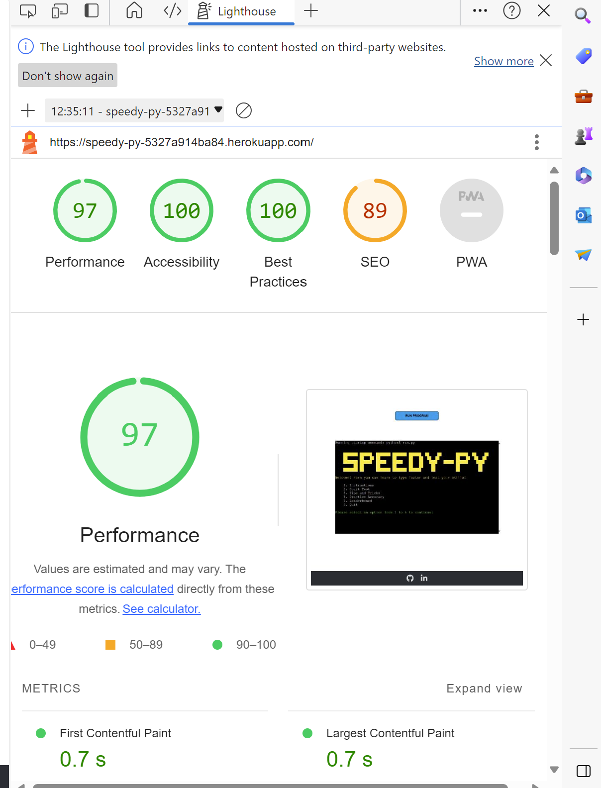

# Typing Test

[Speedy-Py](https://speedy-py.herokuapp.com)

# User Experience (UX)

It is deployed to Heroku to ensure a seamless user experience for players.

## How to Play

## User Goals

## User Stories 

## Website Goals and Objectives

## Target Audience

[Back to top](#contents)

## Flowchart

## Design Choices

Background image is generated by [Gencraft](https://gencraft.com/ "Gencraft"). 

### Responsiveness

My website is responsive to different layouts depending on the size of the viewport have been included in the CSS media queries. This allows visitors to experience the website as I intended on device types and screen sizes. The breakpoints I am using are from Bootstrap.

[Back to top](#contents)

# Features

## Existing Features

### Title and Introduction Section

### Options menu

### Game Over Menu

### Leaderboard

The Leaderboard feature was created using Google Sheets.

## Future Enhancements

## Data Model

[Back to top](#contents)

# Testing

## Accessibility

- Using clear instructions
- Asking for user input before continuing
- Validating inputs before moving on to the next step
- Testing the game to make sure it does not crash from user input
- Using ARIA labels in the README

## Bugs 

[Back to top](#contents)

## Responsiveness Tests

[Back to top](#contents)

## Code Validation

### PEP8 Testing
The python files have all been passed through [PEP8 Online](http://pep8online.com/)

### Error Handling

## User Story Testing

[Back to top](#contents)

## Feature Testing

This website was extensively tested for functionality using both Chrome and Edge developer tools.

Every feature was manually tested using the test script and outcomes recorded. 

[Feature Testing Results](docs/feature-test-results.pdf "Feature Testing Results")

[Back to top](#contents)

## Lighthouse Testing

....   tested in the [Chrome Dev Tools](https://developer.chrome.com/docs/devtools/) and [Microsoft Edge Dev Tools](https://docs.microsoft.com/en-us/microsoft-edge/devtools-guide-chromium/open/?tabs=cmd-Windows) using Lighthouse Testing tool which inspects and scores the website for the following criteria:

* Performance - how quickly a website loads and how quickly users can access it.
* Accessibility - test analyses how well people who use assistive technologies can use your website.
* Best Practices - checks whether the page is built on the modern standards of web development.
* SEO - checks if the website is optimised for search engine result rankings.

Tests for Desktop on Lighthouse Chrome:

Tests for Mobile on Lighthouse Chrome:

Tests for Desktop Lighthouse Edge:

Tests for Mobile on Lighthouse Edge:

[Back to top](#contents)

## Browser Testing

[Browser Compatibility Manual Test](docs/browser-compatibility-test-results.pdf "Browser Compatibility Manual Test")

[Back to top](#contents)

# Deployment

## To deploy the project

- This site was developed using [Gitpod](https://www.gitpod.io/), stored on [Github](https://github.com/) and deployed with [Heroku](https://dashboard.heroku.com/apps).

- Deploying on Heroku:
    1. From the homescreen, click "New" and select "Create new app"
    2. Choose app name, select region and click "Create"
    3. Go to "Settings" and add PORT : 8000 to the Config Vars (CREDS : {contents of creds.json file} also added but excluded from Github for security reasons)
    4. Add heroku/python and heroku/nodejs buildpacks (in that order)
    5. Go to "Deploy" and connect Github repository
    6. Select "Enable Automatic Deploys" and click "Deploy Branch"

_Any changes required to the website, they can be made, committed and pushed to GitHub._

[Back to top](#contents)

## To fork the project

Forking the GitHub repository allows you to create a duplicate of a local repository. This is done so that modifications to the copy can be performed without compromising the original repository.

- Log in to GitHub.
- Locate the repository.
- Click to open it.
- The fork button is located on the right side of the repository menu.
- To copy the repository to your GitHub account, click the button.

## To clone the project

- Log in to GitHub.
- Navigate to the main page of the repository and click Code.
- Copy the URL for the repository.
- Open your local IDE.
- Change the current working directory to the location where you want the cloned directory.
- Type git clone, and then paste the URL you copied earlier.
- Press Enter to create your local clone.

[Back to top](#contents)

# Technologies Used

## Python Libraries:

- [colorama](https://pypi.org/project/colorama/) - for adding colour to terminal text.
- [datetime](https://pypi.org/project/DateTime/): used to get today's date for the leaderboard entry.
- [gspread](https://pypi.org/project/gspread/): to allow communication with Google Sheets. 
- [requests](https://pypi.org/project/requests): enables data retrieval from APIs.
- [google.oauth2.service_account](https://google-auth.readthedocs.io/en/stable/index.html):  used to validate credentials and grant access to google service accounts.
- [pandas](https://pypi.org/project/pandas/) - used for sorting and displaying leaderboard data in user-friendly format.  
- [os](https://docs.python.org/3/library/os.html?highlight=os#module-os) 
  - `os.system` is used in order to clear the terminal when beginning a new game.
  - `os.environ` is used to get Oxford API credentials from environment variables (defined in env.py).

## Tools

* [GitHub](https://github.com/ "GitHub")
* [GitPod](https://www.gitpod.io/#get-started "GitPod")
* [Heroku](https://dashboard.heroku.com/apps "Heroku")
* [Lucidchart](https://lucid.app/documents#/dashboard "Lucidchart")
* [PEP8 Validation](http://pep8online.com/ "PEP8 Validation")
* [TOC Generator](https://ecotrust-canada.github.io/markdown-toc/ "TOC Generator")
* [Am I Responsive](https://ui.dev/amiresponsive "Am I responsive")
* [Responsive Design Checker](https://responsivedesignchecker.com/ "Responsive Design Checker")
* [WAVE Accessibility Tool](https://wave.webaim.org/ "WAVE Accessibility Tool")
* [Image Resize](https://www.iloveimg.com/ "iLoveIMG")

[Back to top](#contents)

# Credits

- Feedback, advice and support:

  - [Simen Daehlin](https://github.com/Eventyret "Simen Daehlin")

- Code inspiration and learning content:

  - [Project Portfolio-3 channel on Slack](https://slack.com/intl/en-ie/ "Slack")
  - [Love Love Sandwiches Project](https://codeinstitute.net "Love Sandwiches Project")
  - [W3C Schools](https://www.w3schools.com/ "W3C Schools")
  - [StackOverflow](https://stackoverflow.com/ "StackOverflow")
  - [CodePen](https://codepen.io/pen/ "CodePen")
  * [How to get current date and time in Python](https://www.programiz.com/python-programming/datetime/current-datetime)
  * [Pandas Sort: Your Guide to Sorting Data in Python](https://realpython.com/pandas-sort-python/)

* YouTube Channels for Speedy-Py functionality: 

  * [Keep Coding](https://www.youtube.com/watch?v=MxrGPP4F8Sc "YouTube")
  * [Web Dev Simplified](https://www.youtube.com/watch?v=riDzcEQbX6k "YouTube")
  * [Great Stack](https://www.youtube.com/watch?v=PBcqGxrr9g8 "YouTube")
  * [James Q Quick](https://www.youtube.com/watch?v=u98ROZjBWy8&list=PLDlWc9AfQBfZIkdVaOQXi1tizJeNJipEx "YouTube")
  * [Ali Aslan](https://www.youtube.com/watch?v=xZXW5SnCiWI&t=2450s "YoutTube")
  * [Code Explained](https://www.youtube.com/watch?v=49pYIMygIcU "YouTube")

* Visual content:

  - [Coolors](https://coolors.co/ "Coolors")
  - [Contrast Grid](https://contrast-grid.eightshapes.com/ "Contrast Grid")

* Images:
  
  - [Gencraft](https://gencraft.com/ "Gencraft")

[Back to top](#contents)