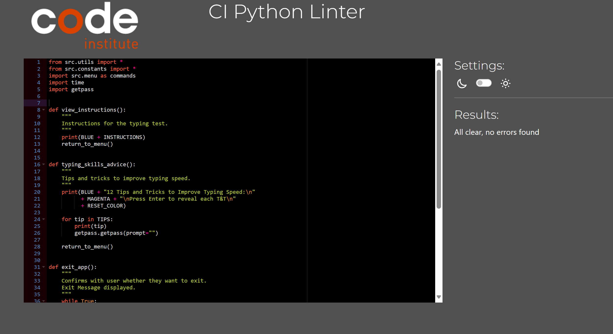

# Speedy-Py

Speedy-Py typing test is a tool designed to evaluate typing speed and accuracy. It provides users with a platform to assess their typing skills in terms of words per minute (WPM) and accuracy rate. The test presents users with a paragraph that they need to type accurately and swiftly within a specified time frame.

By practicing regularly with Speedy-Py, users can enhance their typing skills and become more efficient at keyboard-based tasks.

[Speedy-Py Live](https://speedy-py-5327a914ba84.herokuapp.com/)

# Contents 

- [User Experience (UX)](#user-experience--ux-)
  * [User Goals](#user-goals)
  * [User Stories](#user-stories)
  * [Website Goals and Objectives](#website-goals-and-objectives)
  * [Target Audience](#target-audience)
  * [Colour Scheme](#colour-scheme)
- [Logic](#logic)
  * [Python Logic](#python-logic)
  * [Application Code Structure](#aplication-code-structure)
  * [Database structure](#database-structure)
- [Features](#features)
  * [Existing Features](#existing-features)
    + [Introduction Section](#introduction-section)
    + [Options menu](#options-menu)
    + [View Instructions](#view-instructions)
    + [Test](#test)
    + [Typing Advice](#typing-advice)
    + [Practice Accuracy](#practice-accuracy)
    + [View Leaderboard](#view-leaderboard)
    + [Exit Application](#exit-application)
  * [Future Enhancements](#future-enhancements)
- [Testing](#testing)
  * [Accessibility](#accessibility)
  * [Bugs](#bugs)
  * [Code Validation](#code-validation)
    + [PEP8 Testing](#pep8-testing)
  * [User Story Testing](#user-story-testing)
  * [Manual testing](#manual-testing)
  * [Lighthouse Testing](#lighthouse-testing)
- [Deployment](#deployment)
  * [To deploy the project](#to-deploy-the-project)
  * [To fork the project](#to-fork-the-project)
  * [To clone the project](#to-clone-the-project)
- [Technology](#technology)
  * [Languages used](#languages-used)
  * [Python Libraries](#python-libraries)
  * [Tools](#tools)
- [Credits](#credits)
  * [Disclaimer](#disclaimer)

# User Experience (UX)

It is deployed with Heroku to ensure a seamless user experience for players.

## User Goals

* Improve typing speed and accuracy.
* Enhance overall typing skills.
* Track personal progress over time.
* Enjoy a fun and engaging typing experience.

## User Stories 

As a user, I would like to:
  * Clearly understand the purpose of the application from the first interaction.
  * Use the program in real-life scenarios to enhance my typing skills.
  * Receive clear feedback for the actions I take within the application.
  * Be challenged by having to input actual words rather than random letters.
  * Compare my score to others on the leaderboard.
  * Easily and intuitively navigate through the typing test.
  * Learn how I can improve my typing speed and accuracy based on my score.
  * Have the option to save my results for future reference.
  * Access my previous test results to track my progress.
  * Have the ability to delete specific data entries if needed.

## Website Goals and Objectives

* Provide a user-friendly interface for typing exercises.
* Offer a range of typing tests and exercises tailored to different skill levels.
* Implement features such as words per minute counters, accuracy and progress tracking.
* Allow users to customize their typing practice sessions based on preferences.
* Foster a sense of community through leaderboards and achievements.
* Provide tips how to improve the skills.

## Target Audience

* Students of all ages, including school children, college students, and language learners.
* Professionals who rely  on typing for their daily work tasks, such as writers, programmers and office workers.
* Gamers interested in improving their typing speed and accuracy for gaming competitions or communication.
* Educators seeking effective tools to teach typing skills in classrooms and online learning environments.
* Users looking to enhance their typing abilities in a fun and interactive manner.

##  Colour Scheme

High contrast colors are used to show terminal outputs on a black background to improve readability and accessibility. Warnings are red, standard prompts are yellow and general information is blue. 
Summary of the color scheme used in the terminal:

* MAGENTA: Used for some headings.
* RED: Indicates errors or prompts for confirmation before quitting or deleting.
* GREEN: Indicates success messages or prompts for confirmation before quitting.
* YELLOW: Indicates warnings or prompts for user input.
* BLUE: Used for displaying instructions and tips.
* RESET_COLOR: Used to reset the text color to default.

[Back to top](#contents)

# Logic

## Python Logic

A flow diagram of the logic behind the application was developed using [Lucid Chart](https://www.lucidchart.com/).

As the flow chart was created at the outset of the project, it does not fully reflect all elements of the application.

For PDF version [click here](docs/flowchart-pdf.pdf)

## Application Code Structure

Python code is organized following modularization practices. This increases efficiency and readability of the code. It also assists in refactoring of the code for future improvements. However, [curses](https://docs.python.org/3/library/curses.html) module was used for the typing game. Curses library facilitates the creation of text-based user interfaces within the terminal, handling keyboard input, displaying text with color and formatting. Curses functions are contained in a wrapper. It simplifies the initialization and cleanup of the curses application by handling the initialization and termination of curses mode automatically. All the test related curses functions are contained in one file to avoid the application performance issues.

## Database structure

Google Sheets service is utilized to store project's database in the spreadsheet.

Summary of the data structure:

| Name            | Type       | Other Details            |
|-----------------|------------|--------------------------|
| ID              | String     | Unique identifier        |
| Username        | String     | Name of the user         |
| Completion Date | DateTime   | Date and time of completion |
| Accuracy        | Integer    | Accuracy percentage      |
| WPM             | Integer    | Words per minute         |

Spreadsheet Sample:

[Back to top](#contents)

# Features

## Existing Features

### Introduction Section

The program is run, terminal window displays the main menu of the typing speed test application. It prints the game logo in yellow using [Colorama]("https://pypi.org/project/colorama/") followed by a numbered list of options

### Options menu

The menu continuously displays options list using the loop. To continue using the application, the user is prompted to choose one of the options from 1 to 6. Following the user's selection, the function verifies the input to make sure it is within the permitted range of possibilities. An error message asking the user to select the correct option is presented if the input is invalid. The related action linked to the selected choice is carried out if the input is valid. This functionality ensures seamless navigation through the application's features and facilitates user interaction.

<b>Options Menu Functionality</b>

 View Instructions Display</b>

 

### Test

 It begins by requesting user for their name. Name must be at least two characters. Then it generates a random paragraph for the user to type, which is displayed in the terminal with colorized text. The user is then prompted to begin typing, and their input is recorded. Once the user has finished typing, the function calculates and displays the results of the typing test, including accuracy and speed. It measures time taken in the background for calculations. This function serves as the core component of the typing speed test game, allowing users to assess and improve their typing skills within the terminal environment. Users are also given an option to either save test results or to return to the main menu. If user chooses to save the test, it generates a unique ID for the entry. 

 

<b>Test Functionalities</b>

 ***Name Validation:***

 

 ***Name Entry:***

 

 ***Start Test:***

***Show Results:***

***Save test:***

 

### Typing Advice 

 It displays a list of 12 tips and tricks in the terminal, each designed to improve typing proficiency. It starts by presenting a list of 12 quick fixes in the terminal, all aimed at enhancing typing speed. To make the experience more interactive, users are required to press Enter in order to reveal each advice. Important methods including touch typing, good posture, finger positioning, and consistent practice are covered in the suggestions. The functionality also suggests that users take pauses, practice typing using games, and track their advancement over time. Users can improve their accuracy and speed while strengthening their typing skills by implementing these tips. At the end of the function takes users back to the main menu so they can continue using the typing speed test application after applying these instructions.

<b>Tips and Tricks Display</b>

 

### Practice Accuracy

The user is prompted to practice accurately typing a paragraph that is created at random by the Practice Accuracy function as accuracy is imperative for speed typing skills. The function determines the accuracy of the user's input in relation to the original text once they have completed typing. The user sees a green text message congratulating them on reaching 100% accuracy. If not, the user is shown with a red letter that indicates their accuracy percentage. After that, the function asks the user if they want to attempt inputting the paragraph again. The user can start the practice again or return to main menu.

<b>Practice Accuracy Display</b>

 

### View Leaderboard

This functionality retrieves data from a spreadsheet and organizes it to display the top 10 results in a clear table format. Users are then given the option to remove an entry from the leaderboard. If they choose to do so, users are prompted to input the ID of the entry they wish to delete. The function searches for the corresponding entry, removes it if found, updates the leaderboard, and displays the revised version. If the entry ID is not found, the function alerts the user and allows them to try again. This process ensures accurate leaderboard data and user control over its contents. If they decline, they are returned to the main menu.

<b>View Leaderboard</b>

***Prompt to enter ID:***

 

### Exit Application

Provides users with a confirmation prompt to confirm whether they want to exit the application. It operates within a loop to continuously prompt the user until a valid response is received. The prompt asks users to confirm whether they are sure they want to quit the application, giving them the option to respond with "Y" for yes or "N" for no.
Once a valid response is received, the function checks if the user confirmed they want to quit by entering "Y". If the confirmation is affirmative, the function clears the terminal screen, prints a thank-you message to acknowledge the user's usage of the application, and terminates the program.
If the user chooses not to exit the application by entering "N" or an invalid response, the function clears the terminal screen and returns the user to the main menu.

<b>Exit Application</b>

***Confirm exit:***

***Exit Message:***

 

## Future Enhancements

* Continuously update and improve the application based on user feedback and technological advancements.
* Database to save test results for multiple users
* Share results on Social Media
* Allow users to choose the content theme for the test i.e. legal, fiction, medical etc. 
* Allow users to select time and paragraph length for the test.

[Back to top](#contents)

# Testing

## Accessibility

[WAVE](https://wave.webaim.org/) online tool was used to check terminal colour contrast. ! alert was returned relating to the CI template layout. 

While building the application, the general principles of accessibility where adhered to: 

- Using clear instructions
- Asking for user input before continuing
- Validating inputs before moving on to the next step
- Testing the game to make sure it does not crash from user input
- Using ARIA labels in the README

## Bugs 

| Bug                                              | Status     | Description                                                                                                                           | Steps To Resolve                                                                              |
| ------------------------------------------------ | ---------- | ------------------------------------------------------------------------------------------------------------------------------------- | --------------------------------------------------------------------------------------------- |
| Leaderboard refresh                              | Resolved   | When results saved, they are no displayed in the leaderboard although recorded in the spreadsheet                                      | Refresh added to view_leaderboard function so it refreshes prior to display                    |
| Menu loop                                        | Resolved   | If enter pressed when option selected, error showed                                                                                   | Removed time.sleep functionality                                                              |
| Screen flickering                                | Resolved   | While typing deployed screen kept flickering.                                                                                         | Changed function from screen clear to erase                                                   |
| Test stopped when backspace pressed              | Resolved   | During the test, when backspace pressed test terminated                                                                               | Updated key types in the function                                                             |
| Live results                                     | Resolved   | When live test results functionality enabled, the deployed terminal kept freezing                                                     | Functionality removed due to performance limitations                                          |
| Practice accuracy content                        | Resolved   | When practice accuracy option opened, the results of typing test displayed.                                                           | Added erase function before practice test is ran.                                             |
| Cursor position                                  | Unresolved | The curses is not displaying at the start of paragraph. Although the test functionality is working, some users may find it confusing. | More research is required regarding the capabilities of the curses module in Python.          |
| Delete result                                    | Unresolved | Application allows to delete other user results.                                                                                      | Possibility to introduce log in portal for ability to amend only results related to the user. |
| Input accepted where Hit Enter feature available | Resolved   | User can add text in between the lines tips and tricks. The content is still displayed. The text doesn’t save when option is closed.  | Added getpass module to prevent terminal from echoing user input                              |
| Backspace key                                    | Resolved   | Application terminated when backspace key pressed                                                                                     | Fixed variable declaration                                                                    |

[Back to top](#contents)

## Code Validation

### PEP8 Testing

The python files have all been passed through [PEP8 CI Online](https://pep8ci.herokuapp.com/)

<b>PEP8 Test Results</b>

**run.py:**

**utils.py:**

**game.py:**

**constants.py:**

**options.py:**

**menu.py:**

**spreadsheet.py:**

 

## User Story Testing

| User Story                                                                    | Result                                      | Pass | Screenshot                              |
| ----------------------------------------------------------------------------- | ------------------------------------------- | ---- | --------------------------------------- |
| Clearly understand the purpose of the application from the first interaction. | Name, intro and options reflect the purpose | Pass |  [ View](docs/users-story1.png " View")  |
| Use the program in real-life scenarios to enhance my typing skills.           | Practice accuracy option                    | Pass |  [ View](docs/users-story2.png " View")  |
| Receive clear feedback for the actions I take within the application.         | Feedback based on wpm result                | Pass |  [ View](docs/users-story3.png " View")  |
| Be challenged by having to input actual words rather than random letters.     | Sentences displayed from library            | Pass |  [ View](docs/users-story4.png " View")  |
| Compare my score to others on the leaderboard.                                | View leaderboard option                     | Pass |  [ View](docs/users-story5.png " View")  |
| Easily and intuitively navigate through the typing test.                      | Test displays step by step                  | Pass |  [ View](docs/users-story6.png " View")  |
| Learn how I can improve my typing speed and accuracy based on my score.       | Tips and tricks option                      | Pass |  [ View](docs/users-story7.png " View")  |
| Have the option to save my results for future reference.                      | Option to save top 10 results               | Pass |  [ View](docs/users-story8.png " View")  |
| Access my previous test results to track my progress.                         | View Leaderboard option                     | Pass |  [ View](docs/users-story9.png " View")  |
| Have the ability to delete specific data entries if needed.                   | Option to delete a score                    | Pass |  [ View](docs/users-story10.png " View") |

[Back to top](#contents)

## Manual testing

The application was extensively tested. Failed tests have been recorded in Bugs section. 

<b>Manual testing results</b>

| Functionality     | Test Case                                                | Test Procedure                                                                                                                                                                                                       | Test Data           | Expected Outcome                                                                                                | Status | Comments                                                                                                         |
| ----------------- | -------------------------------------------------------- | -------------------------------------------------------------------------------------------------------------------------------------------------------------------------------------------------------------------- | ------------------- | --------------------------------------------------------------------------------------------------------------- | ------ | ---------------------------------------------------------------------------------------------------------------- |
| Main Menu         | Please select a number from 1 to 6  to continue          | Number 1 and press Enter.                                                                                                                                                                                            | 1                   | Display Instructions                                                                                            | PASS   |                                                                                                                  |
| Main Menu         | Please select a number from 1 to 6  to continue          | Number 2 and press Enter.                                                                                                                                                                                            | 2                   | Load Start Test function                                                                                        | PASS   |                                                                                                                  |
| Main Menu         | Please select a number from 1 to 6  to continue          | Number 3 and press Enter.                                                                                                                                                                                            | 3                   | Display Tips and Tricks                                                                                         | PASS   |                                                                                                                  |
| Main Menu         | Please select a number from 1 to 6  to continue          | Number 4 and press Enter.                                                                                                                                                                                            | 4                   | Load Practice Accuracy Function                                                                                 | PASS   |                                                                                                                  |
| Main Menu         | Please select a number from 1 to 6  to continue          | Number 5 and press Enter.                                                                                                                                                                                            | 5                   | Display Leaderboard                                                                                             | PASS   |                                                                                                                  |
| Main Menu         | Please select a number from 1 to 6  to continue          | Number 6 and press Enter.                                                                                                                                                                                            | 6                   | Exit menu function                                                                                              | PASS   |                                                                                                                  |
| Main Menu         | Handling unexpected input                                | Number 7 and press Enter.                                                                                                                                                                                            | 7                   | Invalid choice message and Menu reload                                                                          | PASS   |                                                                                                                  |
| Main Menu         | Handling unexpected input                                | Press a symbol and Enter.                                                                                                                                                                                            | "/"                 | Invalid choice message and Menu reload                                                                          | PASS   |                                                                                                                  |
| Main Menu         | Handling unexpected input                                | Press Enter.                                                                                                                                                                                                         |                     | Invalid choice message and Menu reload                                                                          | PASS   |                                                                                                                  |
| Instructions      | Verify Display                                           | Select option 1 Confirm that it prints the instructions for the typing test in the expected format and color.                                                                                                     | 1                   | Instructions displayed in the intended format                                                                   | PASS   |                                                                                                                  |
| Instructions      | Handling unexpected input                                | Add unexpected input instead of hit Enter.                                                                                                                                                                           | Random Sentence     | No  input displayed and returns to Main Menu                                                                    | FAIL   | Input was displayed. Recorded in Bugs. Resolved. Added getpass module to prevent input echo                      |
| Instructions      | Verify Return to Menu                                    | Hit enter and wait for Main Menu to load.                                                                                                                                                                            | Enter               | Main Menu is displayed                                                                                          | PASS   |                                                                                                                  |
| Tips and Tricks   | Verify display                                           | Select option 3. Confirm that it prints the 12 tips  to press Enter to reveal each tip.                                                                                                                              | 3 & Enter           | Each line displayed after Enter is hit. After last line, enter brings to Main Menu                              | PASS   |                                                                                                                  |
| Tips and Tricks   | Verify Return to Menu                                    | After displaying all the tips, verify that the function returns to the menu.                                                                                                                                         | Enter               | Main Menu is displayed                                                                                          | PASS   |                                                                                                                  |
| Tips and Tricks   | Handling unexpected inputs - Return to Menu              | Add unexpected input instead of hit Enter.                                                                                                                                                                           | Random Sentence     | No input displayed and returns to Main Menu                                                                     | FAIL   | Input was displayed. Recorded in Bugs. Resolved. Added getpass module to prevent input echo                      |
| Tips and Tricks   | Handling unexpected inputs in display                    | Navigate to Tips and Tricks option. Input text between the lines.                                                                                                                                                    | Random Sentence     | No text displayed. Only tips and tricks content.                                                                | FAIL   | Text was displayed in-between the lines. Recorded in Bugs. Resolved. Added getpass module to prevent input echo. |
| Quit              | User confirms to exit the application with lower case    | Navigate to Quit option. Press "y" and wait for exit message.                                                                                                                                                        | "Y" & Enter         | Exit message displayed                                                                                          | PASS   |                                                                                                                  |
| Quit              | User confirms to exit the application with upper case    | Navigate to Quit option. Press "Y" and wait for exit message.                                                                                                                                                        | "Y" & Enter         | Exit message displayed                                                                                          | PASS   |                                                                                                                  |
| Quit              | User cancels exiting the application with lower case     | Navigate to Quit option. Press "n" and wait for exit message.                                                                                                                                                        | "N" & Enter         | Returns to Main Menu                                                                                            | PASS   |                                                                                                                  |
| Quit              | User cancels exiting the application with upper case     | Navigate to Quit option. Press "N" and wait for exit message.                                                                                                                                                        | "N" & Enter         | Returns to Main Menu                                                                                            | PASS   |                                                                                                                  |
| Quit              | Handling unexpected inputs in Quit option                | Navigate to Quit option. Press a symbol in the keyboard.                                                                                                                                                             | "+" & Enter         | Display Incorrect input and prompt again.                                                                       | PASS   |                                                                                                                  |
| Leaderboard       | Viewing with records                                     | Navigate to Leaderboard option. Confirm that it displays the top 10 results from the spreadsheet, including the relevant headers.                                                                                    | Spreadsheet Entries | Leaderboard displayed based on wpm score.                                                                       | PASS   |                                                                                                                  |
| Leaderboard       | Viewing no records                                       | Navigate to Leaderboard. Confirm that it displays an appropriate message.                                                                                                                                            | Empty Spreadsheet   | No records message displayed                                                                                    | PASS   |                                                                                                                  |
| Leaderboard       | Viewing Leaderboard - no records - Return to Menu        | Navigate to Leaderboard option. Hit enter and wait for Main Menu to load.                                                                                                                                            | Enter               | Main Menu displayed                                                                                             | PASS   |                                                                                                                  |
| Leaderboard       | Handling unexpected inputs - no records - Return to Menu | Navigate to Leaderboard option. Type a random sentence and hit Enter.                                                                                                                                                | Random Sentence     | No input displayed. Returns to Main Menu                                                                        | FAIL   | Input was displayed. Recorded in Bugs. Resolved. Added getpass module to prevent input echo.                     |
| Leaderboard       | Prompt for Deletion - lower case y                       | Navigate to Leaderboard option.  Input lower case when prompted if you would like to delete a result.                                                                                                                | "y"                 | Function proceeds to the deletion process                                                                       | PASS   |                                                                                                                  |
| Leaderboard       | Prompt for Deletion - upper case Y                       | Navigate to Leaderboard option.  Input upper case when prompted if you would like to delete a result.                                                                                                                | "Y"                 | Function proceeds to the deletion process                                                                       | PASS   |                                                                                                                  |
| Leaderboard       | Prompt for Deletion - lower case n                       | Navigate to Leaderboard option.  Input lower case when prompted  to hit enter to return to Main Menu.                                                                                                                | "n"                 | Prompted to return to Main Menu                                                                                 | PASS   |                                                                                                                  |
| Leaderboard       | Prompt for Deletion - upper case N                       | Navigate to Leaderboard option.  Input upper case when prompted to hit enter to return to Main Menu                                                                                                                  | "N"                 | Prompted to return to Main Menu                                                                                 | PASS   |                                                                                                                  |
| Leaderboard       | Handling unexpected inputs in prompt for Deletion        | Navigate to Leaderboard option.  Input a symbol when prompted if would like to delete a result.                                                                                                                      | "/"                 | Displays invalid input and reloads the table                                                                    | PASS   |                                                                                                                  |
| Leaderboard       | Handling unexpected inputs in prompt for Deletion        | Navigate to Leaderboard option.  Hit enter 3 times when prompted if you would like to delete a result.                                                                                                               | Enter               | Reloads the table                                                                                               | FAIL   | Reloads the table multiple times.                                                                                |
| Leaderboard       | Deletion Process                                         | When prompted to enter the ID of the entry  to delete, input a valid entry ID that exists in the leaderboard.                                                                                                        | 1af                 | Deleted the record and reloads the table. Spreadsheet updated.                                                  | PASS   |                                                                                                                  |
| Leaderboard       | Handling unexpected inputs in Deletion process           | When prompted to enter the ID of the entry  to delete, input invalid symbol that does not exist in the leaderboard.                                                                                                  | ">"                 | No entry found message                                                                                          | PASS   |                                                                                                                  |
| Leaderboard       | Incorrect Entry Deletion process                         | When prompted to enter the ID of the entry  to delete, input invalid entry ID that does not exist in the leaderboard. Hit enter to return to Main Menu.                                                              | dpr                 | Returned to Main Menu                                                                                           | PASS   |                                                                                                                  |
| Practice Accuracy |  Initial Test                                            | Navigate to Practice Accuracy option. Type the paragraph accurately, making sure to follow punctuation and capitalization. Press Enter when finished typing.                                                         | Enter               | Option opened. Result displayed when Enter pressed                                                              | PASS   |                                                                                                                  |
| Practice Accuracy | Backspace key                                            | Navigate to Practice Accuracy option. Type the paragraph, attempt to delete typed text using  backspace key.                                                                                                         | Backspace           | Characters delete when backspace pressed.                                                                       | FAIL   | Incorrect variable declaration. Issue resolved.                                                                  |
| Practice Accuracy | Accuracy Measurement                                     | Navigate to Practice Accuracy option. Type the paragraph making 4 mistakes. Ensure that the displayed accuracy percentage is calculated correctly based on the input compared to the original paragraph.             | Enter               | Correct accuracy displayed.                                                                                     | PASS   |                                                                                                                  |
| Practice Accuracy | 100% Accuracy Test                                       | Navigate To Practice Accuracy option. Type the paragraph perfectly, resulting in 100% accuracy.                                                                                                                      | Enter               | Displays the achievement of 100% accuracy                                                                       | PASS   |                                                                                                                  |
| Practice Accuracy | Try Again Option - upper case Y                          | Navigate to Practice Accuracy. Type the text and press Enter. After seeing the accuracy result, press upper case "Y" and wait for new practice to load.                                                              | "Y"                 | New practice test loaded.                                                                                       | PASS   |                                                                                                                  |
| Practice Accuracy | Try Again Option - lower case y                          | Navigate to Practice Accuracy. Type the text and press Enter. After seeing the accuracy result, press upper case "y" and wait for new practice to load.                                                              | "y"                 | New practice test loaded.                                                                                       | PASS   |                                                                                                                  |
| Practice Accuracy | Try Again Option - upper case N                          | Navigate to Practice Accuracy. Type the text and press Enter. After seeing the accuracy result, press upper case "N" and wait for Main Menu to load                                                                  | "N"                 | Main Menu displayed                                                                                             | PASS   |                                                                                                                  |
| Practice Accuracy | Try Again Option - lower case n                          | Navigate to Practice Accuracy. Type the text and press Enter. After seeing the accuracy result, press lower case "n" and wait for Main Menu to load.                                                                 | "n"                 | Main Menu displayed                                                                                             | PASS   |                                                                                                                  |
| Practice Accuracy | Handling unexpected inputs - Try Again Option            | Navigate to Practice Accuracy. Type the text and press Enter. After seeing the accuracy result, press symbol in the prompt.                                                                                          | "?"                 | Invalid input message                                                                                           | PASS   |                                                                                                                  |
| Start Test        |  Initial Setup                                           | Navigate to Start Test, wait for  prompt the user to input the name.                                                                                                                                                 |                     | Application prompts to enter user name                                                                          | PASS   |                                                                                                                  |
| Start Test        | Enter name > 2 characters                                | Navigate to Start Test, enter name more  than 2 characters, press Enter, wait for test to load.                                                                                                                      |                     | Name accepted, test loaded.                                                                                     | PASS   |                                                                                                                  |
| Start Test        | Enter name < 2 characters                                | Navigate to Start Test, enter 1 character, press Enter, wait for validation message to show.                                                                                                                         | "2"                 | Validation error shows, name prompted again.                                                                    | PASS   |                                                                                                                  |
| Start Test        | Typing test - main                                       | Navigate to Start Test, enter correct name, wait for test to load. Read the paragraph carefully and type it accurately, making sure to follow punctuation and capitalization.                                        |                     | Paragraph typed, characters displayed in corresponding colors.                                                  | PASS   |                                                                                                                  |
| Start Test        | Results                                                  | Navigate to Start Test, enter correct name, wait for test to load. Press Enter and wait for results to display. Verify the user feedback.                                                                            |                     | Pressing Enter submits the typed text and proceeds to the results, displays user feedback.                      | PASS   |                                                                                                                  |
| Start Test        | Wpm and accuracy - 100%                                  | Navigate to Start Test, enter correct name, wait for the test to load. Measure time manually and finish test with 100% accuracy                                                                                      |                     | Accuracy and WPM correct                                                                                        | PASS   |                                                                                                                  |
| Start Test        | Wpm and accuracy - 0%                                    | Navigate to Start Test, enter correct name, wait for the test to load. Measure time manually and type words in the test wrong.                                                                                       |                     | Accuracy and WPM correct                                                                                        | PASS   |                                                                                                                  |
| Start Test        | Handling Backspace and Enter Keys                        | Navigate to Start Test, enter correct name, wait for the test to load. Test the functionality of the Backspace key to delete characters                                                                              |                     | Backspace key to deletes characters                                                                             | PASS   |                                                                                                                  |
| Start Test        |  Handling unexpected inputs                              | Navigate to Start Test, enter correct name, wait for the test to load. Attempt to enter various symbols in the paragraph input                                                                                       | "/?>&"              | Input displays without application terminating.                                                                 | PASS   |                                                                                                                  |
| Start Test        | Prompt to Save                                           | Navigate to Start Test, enter correct name, wait for the test to load. Type the paragraph, press Enter. Under the results, prompt to save the test is displayed.                                                     |                     | User is prompted to save the test                                                                               | PASS   |                                                                                                                  |
| Start Test        | Prompt to Save - lower case "y"                          | Navigate to Start Test, enter correct name, wait for the test to load. Type the paragraph, press Enter. Under the results, prompt to save the test is displayed. Enter "y" and press any key to return to Main Menu. |                     | Save message displayed. User prompted to press any key to return to Main Menu. Application loads the Main Menu. | PASS   |                                                                                                                  |
| Start Test        | Prompt to Save - upper case "Y"                          | Navigate to Start Test, enter correct name, wait for the test to load. Type the paragraph, press Enter. Under the results, prompt to save the test is displayed. Enter "y" and press any key to return to Main Menu. |                     | Save message displayed. User prompted to press any key to return to Main Menu. Application loads the Main Menu. | PASS   |                                                                                                                  |
| Start Test        | Prompt to Save - lower case "n"                          | Navigate to Start Test, enter correct name, wait for the test to load. Type the paragraph, press Enter. Under the results, prompt to save the test is displayed. Enter "n" and press any key to return to Main Menu. |                     | User is prompted to save the test                                                                               | PASS   |                                                                                                                  |
| Start Test        | Prompt to Save - upper case "N"                          | Navigate to Start Test, enter correct name, wait for the test to load. Type the paragraph, press Enter. Under the results, prompt to save the test is displayed.                                                     |                     | User is prompted to save the test                                                                               | PASS   |                                                                                                                  |
| Start Test        | Prompt to Save - Handling Unexpected Inputs              | Navigate to Start Test, enter correct name, wait for the test to load. Type the paragraph, press Enter. Under the results, prompt to save the test is displayed. Enter a symbol.                                     | "/"                 | Invalid input message is displayed                                                                              | PASS   |                                                                                                                  |

 

[Back to top](#contents)

## Lighthouse Testing

Speedy-Py was tested in the [Chrome Dev Tools](https://developer.chrome.com/docs/devtools/) and [Microsoft Edge Dev Tools](https://docs.microsoft.com/en-us/microsoft-edge/devtools-guide-chromium/open/?tabs=cmd-Windows) using Lighthouse Testing tool which inspects and scores the website for the following criteria:

* Performance - how quickly a website loads and how quickly users can access it.
* Accessibility - test analyses how well people who use assistive technologies can use your website.
* Best Practices - checks whether the page is built on the modern standards of web development.
* SEO - checks if the website is optimised for search engine result rankings.

<b>Lighthouse Test Results</b>

Tests for Desktop on Lighthouse Chrome:

Tests for Mobile on Lighthouse Chrome:

Tests for Desktop Lighthouse Edge:

Tests for Mobile on Lighthouse Edge:

 

[Back to top](#contents)

# Deployment

## To deploy the project

This site was developed using [**GitPod**](https://www.gitpod.io/), stored on [**GitHub**](https://github.com/) and deployed with [**Heroku**](https://dashboard.heroku.com/apps).

Deploying on Heroku:

* From the homescreen, click **New** and select **Create new app**

* Choose app name, select region and click **Create**

* Go to "****Settings**" and add `PORT : 8000` to the Config Vars (``CREDS ``: {*contents of creds.json file*} also added but excluded from GitHub for security reasons)

* Add ``heroku/python`` and ``heroku/nodejs buildpacks`` (in that order)

* Go to **Deploy** and connect **Github** repository

* Select ``Enable Automatic Deploy`` and click **Deploy Branch**

* The link to deployed application: https://speedy-py.herokuapp.com/

[Back to top](#contents)

## To fork the project

  

Forking the **GitHub** repository allows you to create a duplicate of a local repository. This is done so that modifications to the copy can be performed without compromising the original repository.

- Log in to **GitHub**.

- Locate the repository.

- Click to open it.

- The fork button is located on the right side of the repository menu.

- To copy the repository to your **GitHub** account, click the button.

  
## To clone the project

  
- Log in to **GitHub**.

- Navigate to the main page of the repository and click **Code**.

- Copy the **URL** for the repository.

- Open your local **IDE**.

- Change the current working directory to the location where you want the cloned directory.

- Type git clone, and then paste the **URL** you copied earlier.

- Press **Enter** to create your local clone.
  

_Any changes required to the website, they can be made, committed and pushed to GitHub._

[Back to top](#contents)

# Technology

##  Languages used

-   [Python](https://www.python.org/) - high-level, general-purpose programming language.
-   [Markdown](https://en.wikipedia.org/wiki/Markdown) - markdown language used to write README and TESTING documents.

## Python Libraries

- [colorama](https://pypi.org/project/colorama/) - for adding colour to terminal text.
- [datetime](https://pypi.org/project/DateTime/): used to get today's date for the leaderboard entry.
- [gspread](https://pypi.org/project/gspread/): to allow communication with Google Sheets. 
- [requests](https://pypi.org/project/requests): enables data retrieval from APIs.
- [google.oauth2.service_account](https://google-auth.readthedocs.io/en/stable/index.html):  used to validate credentials and grant access to google service accounts.
- [PrettyTable](https://pypi.org/project/prettytable/) - Python library for easily displaying tabular data in a visually appealing ASCII table format.
- [Curses](https://docs.python.org/3/library/curses.html#module-curses) - terminal handling for character-cell displays.
- [UUID](https://docs.python.org/3/library/uuid.html) - generates a unique ID
- [Wonderwords](https://libraries.io/pypi/wonderwords) - A python package for random words and sentences in English language.
* [getpass](https://docs.python.org/3/library/getpass.html) - prevent input echo in the terminal

## Tools

* [GitHub](https://github.com/ "GitHub")
* [GitPod](https://www.gitpod.io/#get-started "GitPod")
* [Heroku](https://dashboard.heroku.com/apps "Heroku")
* [Lucidchart](https://lucid.app/documents#/dashboard "Lucidchart")
* [PEP8 Validation](http://pep8online.com/ "PEP8 Validation")
* [TOC Generator](https://ecotrust-canada.github.io/markdown-toc/ "TOC Generator")
* [WAVE](https://webaim.org/resources/contrastchecker/ "Web Aim")
* [Google Sheets API](https://developers.google.com/sheets/api "Google Sheets API")

[Back to top](#contents)

# Credits

- Feedback, advice and support:

  - [Simen Daehlin](https://github.com/Eventyret "Simen Daehlin")

- Code inspiration and learning content:

  - [Project Portfolio-3 channel on Slack](https://slack.com/intl/en-ie/ "Slack")
  - [Love Love Sandwiches Project](https://codeinstitute.net "Love Sandwiches Project")
  - [W3C Schools](https://www.w3schools.com/ "W3C Schools")
  - [StackOverflow](https://stackoverflow.com/ "StackOverflow")
  - [CodePen](https://codepen.io/pen/ "CodePen")
  * [Date and time in Python](https://www.programiz.com/python-programming/datetime/current-datetime "Programiz")
  * [Google Sheets API documentation](https://developers.google.com/sheets/api/quickstart/python "Google Sheets")
  * [IIIT Kalyani](https://github.com/GDSC-IIIT-Kalyani/Typing-Speed-Test/blob/main/Speed%20typing.py "GitHub")

* YouTube Channels for Speedy-Py functionality: 

  * [Alina Chudnova](https://www.youtube.com/watch?v=7lGRTeBlDvQ "YouTube")
  * [Make Everyday EZ Day](https://www.youtube.com/watch?v=ykOlbRaNBYU "YouTube")
  * [Web Dev Simplified](https://www.youtube.com/watch?v=R-7eQIHRszQ "YouTube")
  * [Coding Lifestyle 4u](https://www.youtube.com/watch?v=1R8KCdRcoUw "YouTube")
  * [Tech with Tim](https://www.youtube.com/watch?v=NQ5i1kJAA6Y "YouTube")
 

## Disclaimer
-   Speedy-Py app was created for educational purposes only. 

[Back to top](#contents)